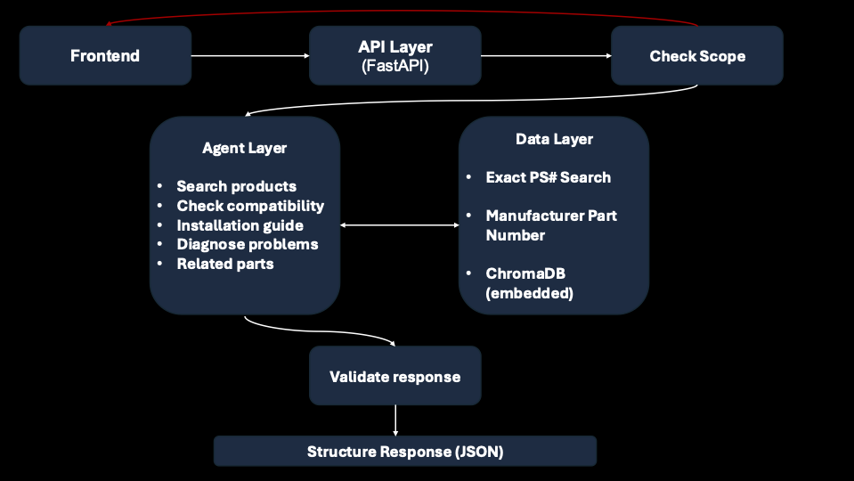

# PartSelect AI Parts Assistant

A conversational support agent for refrigerator and dishwasher replacement parts, built as a 2-day engineering case study. The system lets customers find parts, verify compatibility, get installation guidance, and diagnose appliance problems — all grounded in real scraped data, never model training-data guesses.

**Stack:** FastAPI · Claude Sonnet 4.6 / Haiku 4.5 · ChromaDB · Next.js 15 · Pydantic · Playwright

---

## Architecture



### Detailed  Workflow

```
╔══════════════════════════════════════════════════════════════════════════╗
║                         DATA PIPELINE (offline)                          ║
╠══════════════════════════════════════════════════════════════════════════╣
║                                                                          ║
║   partselect.com  ──Playwright──►  data/scraper.py                       ║
║   (live pages)      (headless=F)   • collect_product_urls()              ║
║                                    • collect_brand_page_urls()           ║
║                                    • scrape_product_page()               ║
║                                      ├─ title, price, brand, rating      ║
║                                      ├─ symptoms, compatible_models      ║
║                                      ├─ installation (difficulty/time)   ║
║                                      └─ repair_story (title + text)      ║
║                                          div.repair-story__title         ║
║                                          div.repair-story__instruction   ║
║                                              │                           ║
║                                              ▼                           ║
║                              data/products.json  (313 parts)             ║
║                              data/model_to_parts.json  (4k+ mappings)    ║
╚══════════════════════════════════════════════════════════════════════════╝
                                    │
                              loaded at startup
                                    │
╔══════════════════════════════════════════════════════════════════════════╗
║                         BACKEND  (FastAPI + Claude)                      ║
╠══════════════════════════════════════════════════════════════════════════╣
║                                                                          ║
║  POST /api/chat                                                          ║
║       │                                                                  ║
║  ┌────▼──────────────────────────────────────────────────────────────┐  ║
║  │  safety.py — check_scope()  [PRE-FLIGHT]                           │  ║
║  │  • blocks out-of-scope appliances (washer, oven, microwave…)       │  ║
║  │  • blocks off-topic (weather, crypto, code…)                       │  ║
║  │  • passes: refrigerator / dishwasher queries                       │  ║
║  └────┬──────────────────────────────────────────────────────────────┘  ║
║       │  in_scope = True                                                 ║
║  ┌────▼──────────────────────────────────────────────────────────────┐  ║
║  │  agent.py — chat_with_agent()                                      │  ║
║  │                                                                    │  ║
║  │  1. select_model(message)                                          │  ║
║  │     ├─ has tool-signal keywords?                                   │  ║
║  │     │   YES → claude-sonnet-4-6  (tool calls, reasoning)           │  ║
║  │     │   NO  → claude-haiku-4-5   (fast conversational reply)       │  ║
║  │                                                                    │  ║
║  │  2. messages.create(model, system_prompt, tools, history)          │  ║
║  │     Claude reasons and optionally calls tools:                     │  ║
║  │                                                                    │  ║
║  │     ┌───────────────────────────────────────────────────┐         │  ║
║  │     │  tools.py  (5 deterministic tools)                 │         │  ║
║  │     │                                                    │         │  ║
║  │     │  search_products(query, appliance_type, top_k)     │         │  ║
║  │     │  └─ 4-tier: PS lookup → MPN scan →                 │         │  ║
║  │     │             skip DB → ChromaDB vector search        │         │  ║
║  │     │                                                    │         │  ║
║  │     │  check_compatibility(part_number, model_number)    │         │  ║
║  │     │  └─ lookup in model_to_parts.json                  │         │  ║
║  │     │                                                    │         │  ║
║  │     │  get_installation_guide(part_number)               │         │  ║
║  │     │  └─ returns difficulty, time, tools,               │         │  ║
║  │     │     repair_story_title, repair_story_text           │         │  ║
║  │     │                                                    │         │  ║
║  │     │  diagnose_problem(symptom, appliance_type)         │         │  ║
║  │     │  ├─ Stage 1: exact symptom match                   │         │  ║
║  │     │  └─ Stage 2: ChromaDB vector search fallback       │         │  ║
║  │     │                                                    │         │  ║
║  │     │  get_related_parts(part_number)                    │         │  ║
║  │     │  └─ shared compatible_models overlap               │         │  ║
║  │     └───────────────────────────────────────────────────┘         │  ║
║  │                                                                    │  ║
║  │  3. safety.py — validate_response()  [POST-FLIGHT]                 │  ║
║  │     └─ checks PS#### mentions exist in our database                │  ║
║  │                                                                    │  ║
║  │  4. _generate_suggestions(message, reply)                          │  ║
║  │     └─ Haiku call → 3 first-person follow-up prompts               │  ║
║  │                                                                    │  ║
║  │  5. Returns ChatResponse:                                          │  ║
║  │     message, products[], tool_calls[], response_type,              │  ║
║  │     installation_result, compatibility_result,                     │  ║
║  │     diagnostic_result, suggested_prompts[]                         │  ║
║  └────────────────────────────────────────────────────────────────────┘  ║
╚══════════════════════════════════════════════════════════════════════════╝
                                    │  JSON over HTTP
╔══════════════════════════════════════════════════════════════════════════╗
║                         FRONTEND  (Next.js 15 + Tailwind)                ║
╠══════════════════════════════════════════════════════════════════════════╣
║                                                                          ║
║  ChatInterface.tsx  (main orchestrator)                                  ║
║  │  reads response_type → routes to exactly one card                    ║
║  │                                                                       ║
║  ├─ response_type = "installation"                                       ║
║  │   └─ InstallationCard.tsx                                             ║
║  │       ├─ "How a customer fixed this"                                  ║
║  │       │   repair_story_title  (quoted headline)                       ║
║  │       │   repair_story_text   (step-by-step paragraph)                ║
║  │       ├─ Difficulty badge  (color-coded green/amber/red)              ║
║  │       ├─ Estimated time                                               ║
║  │       ├─ Tools checklist  (checkbox items)                            ║
║  │       └─ "View all stories on PartSelect →"  (teal button)           ║
║  │                                                                       ║
║  ├─ response_type = "diagnostic"                                         ║
║  │   └─ DiagnosticCard.tsx                                               ║
║  │       ├─ Symptom confirmed  (+ appliance type badge)                  ║
║  │       ├─ Top recommended fix  (title, price, star rating, reviews)    ║
║  │       ├─ "{N} parts known to fix this symptom"                        ║
║  │       └─ ProductCard list  (one per matched part)                     ║
║  │                                                                       ║
║  ├─ response_type = "compatibility"                                      ║
║  │   └─ CompatibilityBanner.tsx  (checkmark/x verdict)                  ║
║  │                                                                       ║
║  ├─ response_type = "general"                                            ║
║  │   └─ ProductCard.tsx list                                             ║
║  │                                                                       ║
║  └─ Suggested prompts  (3 AI-generated first-person follow-up chips)     ║
║                                                                          ║
║  Shared state (React Context):                                           ║
║  ├─ CartContext.tsx    → add/remove parts, item count badge              ║
║  └─ CompareContext.tsx → side-by-side product comparison (max 3)        ║
╚══════════════════════════════════════════════════════════════════════════╝
```

**Request flow in one sentence:** scope-check → model selected (Haiku or Sonnet) → Claude picks tools → tools query local data deterministically → post-validate for hallucinations → Haiku generates contextual follow-ups → typed `ChatResponse` → frontend routes to the right component.

---

## Live Demo Script

Run these prompts to demonstrate every major feature:

| # | Prompt | What it shows |
|---|--------|---------------|
| 1 | `My Whirlpool refrigerator is leaking water from the bottom` | `diagnose_problem` → **DiagnosticCard** (symptom confirmed, top recommended fix with price + stars, matched parts) |
| 2 | `How do I install PS11752778?` | `get_installation_guide` → **InstallationCard** (customer repair story, difficulty badge, tools checklist, link to PartSelect) |
| 3 | `Does PS12364199 fit model FFSS2615TD0?` | `check_compatibility` → **CompatibilityBanner** with green checkmark verdict |
| 4 | `Does PS12364199 fit model WDT780SAEM1?` | Same tool, model not in index → graceful "model not found" fallback |
| 5 | `Show me dishwasher door latches` | `search_products` → **ProductCards** with collapsible details + Compare/Add to Cart |
| 6 | Click Compare on 2–3 cards | **ComparisonView** side-by-side panel |
| 7 | `Thanks, that's all I need` | Routes to Haiku → instant conversational reply, no tool overhead |

---

## Key Design Decisions & Tradeoffs

### 1. Deterministic tools, not LLM inference
Every factual claim — part number, price, compatibility, installation metadata, repair stories — comes from a tool that queries `products.json` or `model_to_parts.json`. Claude handles language only. This eliminates hallucinated part numbers at the source.

> **Tradeoff:** Each tool round adds ~1–2 s of latency. A 3-tool query (diagnose → search → install) takes 4–7 s total. Mitigated by the "Assistant is typing…" progress indicator; streaming is the production fix.

### 2. Model routing: Haiku for conversation, Sonnet for tools
`select_model()` in `agent.py` runs a compiled regex over the user message before making any API call. Messages with tool-signal keywords (`install`, `compatible`, `leaking`, `PS\d+`, etc.) go to `claude-sonnet-4-6` for its stronger reasoning and tool-use accuracy. Pure conversational messages (`hi`, `thanks`, `what can you do?`) route to `claude-haiku-4-5` — ~4× faster and cheaper with identical response quality for simple replies. Zero-latency decision: no API call needed to classify.

### 3. Retrieval strategy: 4-tier cascade (`tools.py: search_products`)
1. Exact PS-number dict lookup — O(1)
2. Exact manufacturer part number scan — O(n)
3. PS/MPN-shaped query not in local DB → skip ChromaDB (avoids wrong semantic matches), provide PartSelect search link via Claude text
4. ChromaDB vector search for natural-language queries (title + description + symptoms indexed)

ChromaDB is embedded (`PersistentClient`, `data/chromadb/`) — no external service, zero ops, single-line swap to server mode at scale.

### 4. Real customer repair stories (not just metadata)
The scraper captures the top-voted customer repair story from each product page — the actual `div.repair-story__title` headline and `div.repair-story__instruction` text that PartSelect users write after completing a repair. 216 of 313 parts (69%) have these stories. The `InstallationCard` leads with the story as step 1, making the installation guidance genuinely useful rather than just showing difficulty/time labels.

### 5. Safety: code-level guardrails, not just prompt instructions
- **Pre-filter** (`safety.py: check_scope`): appliance blocklist + off-topic keywords + 4-word heuristic. Runs before any Anthropic API call — costs 0 tokens. The `has_history` flag bypasses the heuristic for follow-up messages so chips like "How long does this take?" are not rejected mid-conversation.
- **Post-check** (`safety.py: validate_response`): regex scans Claude's text for PS-numbers not in `_products`. Appends a visible disclaimer on failure.

### 6. Typed response contract (`models.py: ChatResponse`)
`response_type` (`"general"` | `"installation"` | `"compatibility"` | `"diagnostic"`) is set deterministically in the agent loop — not inferred. The frontend reads it as a discriminated union to route to exactly one component. This eliminates double-renders and brittle field-presence checks.

### 7. AI-generated follow-up suggestions
After every response, a second Haiku call generates 3 contextual follow-up prompts written in first-person ("Does this part fit my model?", "How long does the repair take?"). These are grounded in the actual assistant reply rather than hardcoded per response type, so they stay relevant across conversations.

---

## Data Sources

| Source | What it is | File |
|---|---|---|
| PartSelect.com (scraped) | 313 real parts: prices, images, ratings, symptoms, compatible models | `data/products.json` |
| PartSelect.com (scraped) | Customer repair stories: top-voted title + step-by-step text per part | `data/products.json` (nested in `installation`) |
| PartSelect.com (scraped) | Model → compatible parts reverse index (4,000+ mappings) | `data/model_to_parts.json` |
| ChromaDB | Vector embeddings of title + description + symptoms + MPN | `data/chromadb/` |

**No mock data.** All 313 products have real URLs, CDN image links, PartSelect-sourced compatibility lists, and where available, real customer repair instructions.

### Dataset coverage

| Field | Count | % |
|---|---|---|
| Price | 313 / 313 | 100% |
| Compatible models | 312 / 313 | 99% |
| Rating | 231 / 313 | 74% |
| Symptoms | 185 / 313 | 59% |
| Repair stories | 216 / 313 | 69% |

### Regenerate / expand the dataset

```bash
# Scrape up to 250 parts per category (refrigerator + dishwasher)
python data/scraper.py           # writes scraped_parts.json → products.json + model_to_parts.json

# Rebuild the ChromaDB vector index
python -c "from backend.tools import build_vector_store; build_vector_store()"

# Restart the backend to reload data
uvicorn backend.main:app --reload --port 8000
```

To expand coverage, adjust `MAX_PARTS_PER_CATEGORY` in `data/scraper.py` (currently `250`).

---

## Setup & Run Locally

### Prerequisites
- Python 3.11+
- Node.js 18+ / npm
- An Anthropic API key
- Playwright browsers: `playwright install chromium`

### 1. Clone and configure environment

```bash
git clone <repo-url>
cd instalily-casestudy-main

# Create .env in project root
echo "ANTHROPIC_API_KEY=sk-ant-..." > .env
```

### 2. Backend

```bash
pip install -r backend/requirements.txt

uvicorn backend.main:app --reload --port 8000

# Verify
curl http://localhost:8000/health
# → {"status":"ok"}
```

### 3. Frontend

```bash
cd frontend_

# Optional: set backend URL (defaults to http://localhost:8000)
echo "NEXT_PUBLIC_API_URL=http://localhost:8000" > .env.local

npm install
npm run dev
# → http://localhost:3000
```

---

## API Contract

### `POST /api/chat`

**Request:**
```json
{
  "message": "Does PS11752778 fit model WDT780SAEM1?",
  "history": [
    { "role": "user", "content": "I need a door shelf bin" },
    { "role": "assistant", "content": "I found a few options..." }
  ],
  "conversation_id": "optional-uuid"
}
```

**Response:**
```json
{
  "message": "PS11752778 is not compatible with model WDT780SAEM1...",
  "products": [...],
  "tool_calls": [
    {
      "tool": "check_compatibility",
      "args": { "part_number": "PS11752778", "model_number": "WDT780SAEM1" },
      "result_summary": "{\"compatible\": false, \"model_found\": false...}"
    }
  ],
  "installation_result": null,
  "compatibility_result": {
    "compatible": false,
    "model_found": false,
    "compatible_parts": []
  },
  "diagnostic_result": null,
  "response_type": "compatibility",
  "suggested_prompts": [
    "What models is PS11752778 compatible with?",
    "Show me door shelf bins that fit WDT780SAEM1",
    "What's the price of PS11752778?"
  ],
  "conversation_id": "abc-123"
}
```

**`response_type` routing:**

| `response_type` | Component rendered | Trigger |
|---|---|---|
| `"general"` | `ProductCard` list | `search_products`, `get_related_parts` |
| `"installation"` | `InstallationCard` | `get_installation_guide` fired |
| `"compatibility"` | `CompatibilityBanner` | `check_compatibility` fired |
| `"diagnostic"` | `DiagnosticCard` | `diagnose_problem` fired |

**`installation_result` shape** (when `response_type = "installation"`):
```json
{
  "found": true,
  "part_number": "PS11752778",
  "title": "Refrigerator Door Shelf Bin WPW10321304",
  "installation": {
    "difficulty": "Really Easy",
    "time": "Less than 15 mins",
    "tools": "Screw drivers",
    "repair_story_title": "Door bin cracked and needed replacing",
    "repair_story_text": "Removed the old bin by lifting up and pulling out. Snapped the new one in place. No tools needed."
  },
  "url": "https://www.partselect.com/PS11752778-..."
}
```

---

## Testing & Evaluation

### Backend unit tests

```bash
python -m pytest backend/tests/ -v
```

Test files cover: `test_agent.py`, `test_tools.py`, `test_safety.py`, `test_models.py`, `test_main.py`, `test_integration.py`.

### Manual eval cases

| Query | Expected tool | Expected component |
|---|---|---|
| `"My fridge is leaking"` | `diagnose_problem` | DiagnosticCard (symptom + top fix) |
| `"How do I install PS11752778?"` | `get_installation_guide` | InstallationCard (with repair story) |
| `"Does PS12364199 fit FFSS2615TD0?"` | `check_compatibility` | CompatibilityBanner (green checkmark) |
| `"Does PS12364199 fit WDT780SAEM1?"` | `check_compatibility` | CompatibilityBanner (model not found) |
| `"WPW10295370A"` (not in DB) | `search_products` → empty | Claude text with PartSelect search link |
| `"How do I bake a cake?"` | blocked | Scope rejection message |
| `"How long does this take?"` (follow-up) | context-dependent | Passes scope (`has_history` bypass) |
| `"Hi, what can you help with?"` | none (Haiku) | Fast conversational reply |

### Smoke test via curl

```bash
# General search
curl -s -X POST http://localhost:8000/api/chat \
  -H "Content-Type: application/json" \
  -d '{"message":"water filter for refrigerator","history":[]}' \
  | python3 -m json.tool

# Installation guide (expect repair story in result)
curl -s -X POST http://localhost:8000/api/chat \
  -H "Content-Type: application/json" \
  -d '{"message":"how do I install PS11752778?","history":[]}' \
  | python3 -c "
import sys, json
d = json.load(sys.stdin)
inst = d.get('installation_result', {}) or {}
print('response_type:', d['response_type'])
print('found:', inst.get('found'))
print('story:', bool(inst.get('installation', {}).get('repair_story_title')))
"
# Expect: installation True story True
```

---

## Limitations

- **Dataset size:** 313 parts (250 per category cap). Common parts outside this set fall back to a PartSelect search link rather than a product card.
- **Live lookup blocked:** PartSelect uses Cloudflare bot protection. `_live_lookup()` in `tools.py` attempts an HTTP fetch but receives a 403; it degrades gracefully to Claude providing a search URL in text.
- **No streaming:** Responses are fully buffered before returning. Multi-tool queries take 4–7 s. The "typing" animation is the current UX mitigation.
- **In-memory conversation state:** History is stored in the browser. No server-side session persistence; switching devices loses history.
- **Repair story coverage:** 69% of parts have customer repair stories. Parts with no stories on PartSelect fall back to showing just difficulty/time metadata in the InstallationCard.

---

## Roadmap / Next Improvements

Ordered by impact:

1. **Streaming responses** — ~30-line change in `agent.py` + `main.py`. Drops perceived latency to <1 s. Highest user impact.
2. **Router + specialist sub-agents** — Introduce `backend/router.py` that classifies intent and dispatches to dedicated agents (InstallationAgent, DiagnosticAgent, SearchAgent). Unlocks parallel tool execution and per-domain system prompts.
3. **Backend conversation persistence** — `conversation_id` already exists in `ChatRequest`/`ChatResponse`. Wire to Redis or Postgres for multi-device history.
4. **Eval harness** — 50 golden (query, expected_tool, expected_response_type) tuples. Run on every commit. Alert on tool-selection regression.
5. **Structured logging + telemetry** — Ship `tool_calls` arrays to a log aggregator. Add P95 latency and `validate_response` issue-rate metrics.

---

## How to Extend

### Add a new tool

1. **Write the function** in `backend/tools.py`
2. **Register the schema** in the `TOOL_DEFINITIONS` list in `backend/agent.py`
3. **Wire the dispatch** in `_execute_tool()` in `backend/agent.py`
4. **Optionally capture the result** for a specialised UI component — follow the same pattern as `installation_result` / `compatibility_result` / `diagnostic_result` in the tool loop

Claude will automatically select the new tool when relevant.

### Add a new response type and UI component

1. Extend the `Literal` in `backend/models.py`
2. Set it in the agent loop when your new tool fires
3. Add the result field to `ChatResponse` in `backend/models.py`
4. Mirror the type in `frontend_/lib/types.ts`
5. Create the component in `frontend_/app/components/`
6. Add the branch to the discriminated union in `ChatInterface.tsx`

### Add a new appliance domain (e.g. washing machines)

1. Remove it from `OUT_OF_SCOPE_APPLIANCES` in `backend/safety.py` and add to `IN_SCOPE_APPLIANCES`
2. Add the category URL to `CATEGORY_URLS` in `data/scraper.py` and re-run
3. Rebuild ChromaDB: `python -c "from backend.tools import build_vector_store; build_vector_store()"`
4. Update the scope description in the system prompt in `backend/agent.py`

No other changes required — all five tools are appliance-agnostic.

---

## File Structure

```
instalily-casestudy-main/
│
├── backend/
│   ├── agent.py          # Claude tool loop, model routing, suggestion generation
│   ├── tools.py          # 5 deterministic tool functions + ChromaDB setup
│   ├── models.py         # Pydantic models: Product, Installation, ChatRequest, ChatResponse
│   ├── safety.py         # check_scope() pre-filter + validate_response() post-check
│   ├── main.py           # FastAPI app, CORS, /api/chat + /health endpoints
│   └── tests/            # Unit + integration tests (pytest)
│
├── data/
│   ├── scraper.py           # Playwright scraper → products.json + model_to_parts.json
│   ├── products.json        # 313 real parts (keyed by PS number, includes repair stories)
│   ├── model_to_parts.json  # Reverse index: model# → [part#, ...]
│   └── chromadb/            # Persistent ChromaDB vector index
│
├── frontend_/
│   ├── app/
│   │   └── components/
│   │       ├── ChatInterface.tsx      # Main chat UI, discriminated rendering, suggested prompts
│   │       ├── ProductCard.tsx        # Part card with collapsible details + compare/cart
│   │       ├── InstallationCard.tsx   # Repair story + difficulty / time / tools + PartSelect link
│   │       ├── DiagnosticCard.tsx     # Symptom confirmed + top recommended fix + parts list
│   │       ├── CompatibilityBanner.tsx   # Checkmark/x verdict + amber model-not-found banner
│   │       ├── ComparisonView.tsx     # Side-by-side product comparison (max 3)
│   │       ├── CartContext.tsx        # Shopping cart state
│   │       └── CompareContext.tsx     # Comparison panel state
│   └── lib/
│       ├── types.ts      # TypeScript interfaces mirroring Pydantic models
│       └── api.ts        # sendMessage() with retry logic
│
└── .env                  # ANTHROPIC_API_KEY (not committed)
```
